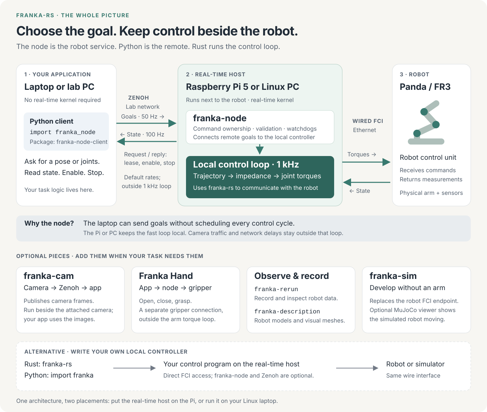

# Architecture in detail

[Back to the simple overview](./architecture.md).

**Your program chooses the goal. The machine beside the robot turns it into motion.**
For the simplest application interface, run `franka-node` on a Pi 5 or realtime Linux PC
and use `franka_node` from Python. The same Python program works whether the node is on
that PC or across the network on a Pi.



[Open or download the full diagram](../assets/architecture.svg).

## Follow one command

Suppose your Python program asks to move the hand up by 5 cm:

1. **Python sets a goal.** `targets.move_by([0, 0, 0.05])` returns immediately. The
   `franka-node-client` background thread advances targets toward that goal, at 50 Hz by
   default. It handles the lease, message numbering and keepalive.
2. **Zenoh delivers messages.** Targets go to the node; measured state comes back at
   100 Hz by default. Acquire, enable and stop use request/reply. A direct connection
   needs no separate Zenoh router.
3. **The node decides whether to accept each target.** It checks the arm's owner,
   target validity, step and lead bounds, joint goals and any configured workspace box.
   It handles sessions and watches for a disconnected or silent client.
4. **The Rust library makes continuous motion locally.** `franka-rs` generates a trajectory
   with velocity, acceleration and jerk limits and runs its impedance controller on a
   realtime thread. The node's default backend sends joint torques at 1 kHz over wired FCI.
5. **Python observes the result.** `targets.wait(timeout=5.0)` waits for the accepted goal
   and the measured pose to agree within the client's tolerances. It is not an acknowledgement
   that every arbitrary goal is reachable.

The Python program does **not** send a torque every millisecond. Neither Python's GIL nor
Zenoh is on the 1 kHz path. On a Panda, the FCI v5 command also carries the required zero
joint-velocity motion-generator field alongside the external torques; this is still torque
control ([Panda specifics](../reference/fer.md)).

## Why each piece exists

| Piece | Its job | Do I install it? |
|---|---|---|
| `franka-node` | Own the robot connection, manage sessions and run control beside the arm | Yes, on the control host for the node setup |
| `franka-node-client` / `import franka_node` | Turn Python goals into a paced target stream; manage access and read state | Yes, where your application runs |
| Zenoh | Carry goals, state and requests between application and node | Included as dependencies; no separate router for a direct connection |
| `franka-rs` | Speak FCI, calculate the model, generate trajectories and torques | Already compiled into the node |
| `franka-py` / `pip install franka-rs` / `import franka` | Use that library directly inside a Python process | An alternative to the node client; not required with it |
| Franka Hand | Grasp objects through its separate connection, exposed by the node when configured | Optional hardware; built-in node driver |
| `franka-cam` | Capture camera frames and publish them over Zenoh | Optional separate process near the cameras |
| `franka-rerun` | Record and replay motion; node recording is a build feature | Optional; the Rerun viewer opens recordings |
| `franka-description` | Supply robot meshes for visualization | Dependency of visualization tools, not a controller |
| `franka-sim` | Replace the robot's FCI endpoint for development | Optional separate simulator, with an optional MuJoCo desktop viewer |

The simulator's MuJoCo viewer shows a simulated robot. Rerun shows live or recorded data.
They are different viewers with different jobs. See [simulation with visualization](./simulator.md#start-with-visualization)
and [recording](../howto/flight-recorder.md).

## Pi or laptop: the same interface

| Layout | Where Python runs | Where the node and 1 kHz loop run | Python endpoint |
|---|---|---|---|
| Pi beside the robot | Your ordinary laptop or workstation | Pi 5 with realtime Linux, wired to robot | `tcp/<pi-address>:7447` |
| One computer | The same Linux PC | That PC with realtime Linux, wired to robot | `tcp/127.0.0.1:7447` |
| Try without hardware | Your development machine | Linux host alongside the simulator; realtime enforcement can be disabled for simulation | Localhost or the Linux host's address |

An ordinary macOS or Windows laptop can be the remote **client**, not the realtime control
host. Moving the node from a PC to a Pi changes the endpoint, not your application's control
logic. One node can serve multiple arms, each with its own loop; that alone does not make
the arms' motions synchronized or collision-aware.

Use the direct Rust library for your own 1 kHz callback or observer. Use `import franka`
for high-level Python target control inside a local process; it does not expose Python
callbacks at 1 kHz. Both run on the realtime machine and bypass the node and Zenoh.
For an application that just sends goals, the node offers a consistent interface for both layouts.

## Start it today

These install from a checkout; `cargo install franka-node --locked` and `pip install franka-node-client`
of one release do the same.
A real robot first needs the [realtime host](./realtime-machine.md), wired network and FCI
mode prepared. The [Pi guide](./raspberry-pi.md) walks through that one-time setup.

**On the control host:**

```sh
cargo install --path crates/franka-node --locked
```

Create `node.toml` before starting:

```toml
name = "controller"

[zenoh]
listen = ["tcp/0.0.0.0:7447"]
multicast_scouting = false

[[arm]]
name = "arm"
host = "172.16.0.2"
realtime = "enforce"
```

Use the robot's actual address. Plain TCP here assumes a trusted network. For simulation,
use the simulator host (usually `127.0.0.1`) and `realtime = "ignore"`; keep enforcement on
for a physical arm. Start the node after saving the configuration:

```sh
franka-node node.toml
```

This connects and publishes state; it does not start motion.

**On the application machine, inside a Python virtual environment:**

```sh
python -m pip install ./crates/franka-node/python
```

Read state first, without acquiring control or moving the robot:

```python
import franka_node

with franka_node.Node("tcp/<control-host>:7447") as node:
    print(node.arm("arm").state().position)
```

The following example **moves the robot up by 5 cm**. Run it only with that path clear and
the robot ready for motion, as described in the [first-motion guide](./pi-software.md#first-motion-moves-the-arm).

```python
import franka_node

with franka_node.Node("tcp/<control-host>:7447") as node:
    with node.arm("arm") as arm:
        with arm.cartesian_targets() as targets:
            targets.move_by([0.0, 0.0, 0.05])
            targets.wait(timeout=5.0)
```

Leaving the contexts stops the session and releases access. Once the host is provisioned,
run the node [as a service](./pi-software.md#run-the-node-as-a-service): everyday use then
means opening your Python application, not rebuilding Rust or starting a router.

## What is published?

From 0.4.0 one version covers everything a release publishes:

| Where | What |
|---|---|
| crates.io | [`franka-rs`](https://crates.io/crates/franka-rs), [`franka-description`](https://crates.io/crates/franka-description), [`franka-rerun`](https://crates.io/crates/franka-rerun), [`franka-node`](https://crates.io/crates/franka-node), [`franka-cam`](https://crates.io/crates/franka-cam) |
| PyPI | [`franka-rs`](https://pypi.org/project/franka-rs/) (direct Python bindings), [`franka-node-client`](https://pypi.org/project/franka-node-client/), [`franka-vr-teleop`](https://pypi.org/project/franka-vr-teleop/) |
| GitHub release | prebuilt `franka-node` and `franka-cam` tarballs for the Pi (aarch64) and x86_64 Linux |

Use the node and `franka-node-client` of the same version. The simulator is a separate
project with its own versions.

## How mature is this?

The core control and messaging interfaces are implemented and tested. Installation and
host preparation still require manual steps.

- **Implemented:** trajectory generation, torque control, target guards, leases, watchdogs,
  paced Python streaming, state feedback, homing, recovery and optional recording.
- **Still bounded:** the impedance reference retains an FR3 hardware-validation caveat;
  node gripper control and pushing the arm in a joint session are not hardware-validated.
  Camera recording is tested with synthetic input.
- **Missing polish:** manual host setup, no setup wizard or `doctor` command,
  and no automatic exchange of the node's configured motion limits with the Python client.
  Rejected targets are counted; detailed reasons live in the node's debug log.

The defaults hide much of the continuity work already. They cannot guarantee every goal
is feasible: joint limits, singularities, payload, contacts and network faults still matter.
A configured workspace box is not obstacle planning or dual-arm collision avoidance.
The goal should be to handle routine limits automatically and explain an impossible move
clearly, rather than ask users to tune low-level control parameters.

A lost client triggers local stop handling, not an instantaneous emergency stop. Holding
retains the accepted target and can still move toward it; a controlled stop may finish there.
The Python streamer keeps a session alive even while user code is idle. See the precise
[watchdog and stop behavior](../howto/franka-node.md#from-python).

## The simpler experience to build next

These are **proposed features, not commands available today**:

| Priority | User experience | Work needed |
|---|---|---|
| 1. Install | One supported install path for Pi and Linux PC; one Python package | Publish matching binaries/packages, verify clean-machine installs, pin compatible versions |
| 2. Set up once | Name the robot, see “ready”, start automatically at boot | Guided config and service installation; check kernel, scheduling, network and FCI without moving the arm |
| 3. Send a goal | Defaults adapt to the connected node | Exchange protocol/capabilities/limits; validate goals early; return structured refusal reasons and actionable errors |
| 4. Handle interruptions | Clear connection, ownership, holding and fault states | Connection diagnostics; deliberate recovery and re-enable; explain what stop does |
| 5. Trust the result | A small, documented support matrix | Repeatable Panda/FR3, Pi/PC, load and disconnect validation; explicit peripheral validation |

The product direction is **one application API, two places to run the controller**.
Expose “connect, move, grasp, observe” first. Keep budgets, gains, wire layouts and tuning
in advanced pages. A prepared Pi can make daily use one or two commands; preparing a fresh
realtime host is still a separate setup task.

Implementation evidence: [node and hardware status](https://github.com/BarisYazici/franka-rs/tree/main/crates/franka-node),
[Python client](https://github.com/BarisYazici/franka-rs/tree/main/crates/franka-node/python),
[impedance validation](../reference/impedance.md), [peripheral status](./peripherals.md), and
[release workflow](https://github.com/BarisYazici/franka-rs/blob/main/.github/workflows/release.yml).
