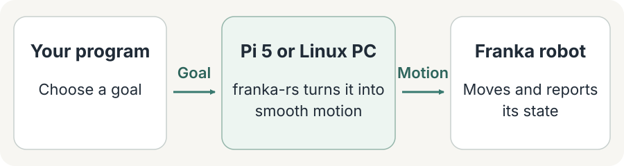

# How the pieces fit

**Your program chooses where to move. franka-rs handles the control loop.**

You can run everything on one Linux PC, or let a Raspberry Pi 5 control the robot
while your program runs on your laptop.

<picture>
  <source media="(max-width: 600px)" srcset="../assets/architecture-simple.svg">
  
</picture>

## What do I need?

**On one computer:** use `franka-rs` from Rust or Python on the Linux PC connected
to the robot. The library runs the control loop inside your program.

**With a Pi:** run `franka-node` on the Pi and use `franka-node-client` in your laptop's
Python program. The node is a service that runs `franka-rs` beside the robot, so your
laptop can send goals and read the robot's state over the network.

The computer connected to a real robot needs realtime Linux and wired Ethernet.
The [setup guides](./choose-your-setup.md) walk through that preparation.
Cameras and recording can be added later.

## Start here

- **Have a Pi?** [Set up the Pi and your laptop](./raspberry-pi.md).
- **Using one Linux PC?** [Install the library](./install.md).
- **No robot yet?** [Try the simulator and viewer](./simulator.md#start-with-visualization).

For the full component diagram, message flow and package reference, see
[Architecture in detail](./architecture-details.md).
