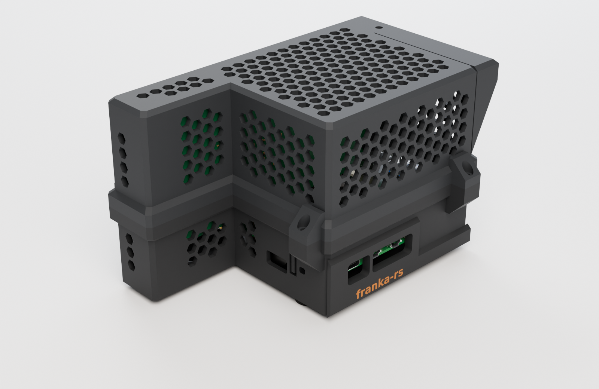

# 4. Optional enclosure

The controller works without a printed case. This two-part enclosure supports the
**Pi 5 + Active Cooler + P02 + low-profile I350-T2 V2** reference assembly.

<figure class="hardware-figure">

<figcaption>Revised bracket-fold design. Approx. 158.3 × 107.6 × 91 mm assembled, or 94 mm with feet. CAD illustration, not a photograph of a validated print.</figcaption>
</figure>

The current downloads include a dedicated slot and reinforced supports for the Intel
bracket's folded edge. Use the base and lid from the same print bundle.

## Look inside

[Open the interactive 3D viewer](../site/pi-viewer.html?model=enclosure) to rotate the case,
switch to the electronics, or inspect the exploded assembly. No plugin is required.

The Pi geometry comes from official CAD. The cooler, P02 and NIC are modeled from
manufacturer drawings and photographs; some dimensions are estimates. **Check your actual
adapter, card and bracket before printing.** Other boards or brackets may not fit.

## Download the right file

| You want to… | Download |
|---|---|
| Print both parts | [Print bundle: ZIP](../assets/pi5/enclosure-print.zip) — two STLs and a 3MF |
| Open both parts in a slicer | [enclosure.3mf](../assets/pi5/enclosure.3mf) |
| Slice one part | [base.stl](../assets/pi5/base.stl) · [lid.stl](../assets/pi5/lid.stl) |
| Edit the enclosure in CAD | [base.step](../assets/pi5/base.step) · [lid.step](../assets/pi5/lid.step) |
| View the enclosure with electronics | [enclosure-scene.glb](../assets/pi5/enclosure-scene.glb) |
| View the electronics alone | [assembly.glb](../assets/pi5/assembly.glb) · [assembly-exploded.glb](../assets/pi5/assembly-exploded.glb) |

**STL / 3MF are for slicing; STEP is for editing; GLB is for viewing.** The GLB includes
electronics and cables and must not be treated as a printable case.
The 3MF contains both meshes and their layout, not a tested printer profile.

[Model sources and attribution](../assets/pi5/SOURCES.txt) ·
[File sizes, revision timestamps and SHA-256 hashes](../assets/pi5/manifest.json).

## Slice a fresh print

Use the STLs in their supplied print orientation, or open the 3MF and select your own
printer and material. The design notes specify this starting point:

| Setting | Design starting point |
|---|---|
| Nozzle / layer height | 0.6 mm / 0.3 mm |
| Walls / top and bottom | 4 perimeters / 5 layers |
| Infill | 25% gyroid |
| Supports | Designed for no supports; inspect bridges in your slicer |
| Bed | Both parts arranged on a 220 × 220 mm plate |
| Base / lid orientation | Base floor on bed / lid roof on bed |

Review the sliced result before printing; extrusion width, bridging, material and machine
settings affect the fit. The earlier **0.4 mm G-code is stale and is intentionally not
provided**. Generate new G-code from this geometry for your printer's 0.6 mm profile.
Let the bed cool before removing the parts; flex the plate rather than prying at the port wall.

## Fasteners and assembly

In addition to the P02's pillars, the design calls for:

- 7 M2.5 × 4 mm heat-set inserts (holes sized at 3.6 mm diameter).
- 5 M2.5 × 8 mm socket-head screws: four lid screws and one bracket clamp screw.
- 4 M2.5 × 10 mm floor screws and 2 M2.5 × 6 mm P02 mounting screws.
- 4 adhesive rubber feet, 12.7 mm diameter × 3.5 mm.

Fit the inserts, connect the ribbon, and mount the P02/Pi stack in the base. Check screw
engagement against the actual pillar threads. Seat the card through the bracket groove and
lower guide, with the bracket's folded edge in its dedicated slot; fit the lid so the card enters the upper guide, then secure the lid and bracket.
Avoid forcing the card or overtightening the clamp.

The design has undergone CAD clearance and insertion checks, but bracket position and port
heights still include estimates. Thermal performance and the revised printed fit have not
been established by these model checks. Keep the Active Cooler and ventilation unobstructed.

<nav class="guide-nav" aria-label="Setup steps"><a rel="prev" href="./pi-software.html">Node and laptop client</a><a rel="next" href="./peripherals.html">Next: cameras and recording</a></nav>
