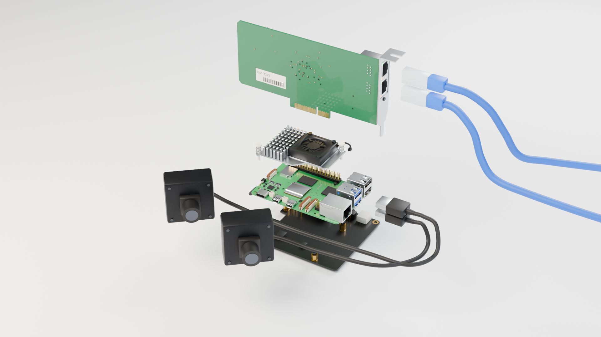

# 1. Parts and assembly

Build the electronics first. The enclosure and cameras can come later.

## Shopping list

These are the parts used in the reference model. Product links identify the part; prices
and availability vary. **P02 is the modeled reference**; the enclosure is specific to that
adapter. Check your board label before buying matching enclosure parts.

| Part | Qty | What to look for / links |
|---|---:|---|
| Raspberry Pi 5 | 1 | The reference BOM uses the 2 GB model. [Official product and resellers](https://www.raspberrypi.com/products/raspberry-pi-5/). More RAM is useful for compiling locally. |
| Raspberry Pi Active Cooler | 1 | **SC1148**, fits the Pi 5 fan header and mounting holes. [Product](https://www.raspberrypi.com/products/active-cooler/) · [installation brief](https://datasheets.raspberrypi.com/cooling/raspberry-pi-active-cooler-product-brief.pdf). |
| Official 27 W USB-C power supply | 1 | Use the version for your mains socket and its attached cable. [Product and resellers](https://www.raspberrypi.com/products/27w-power-supply/). |
| microSD card | 1 | Reference: 64 GB A2. The NIC occupies the Pi's PCIe connection, so this build boots from microSD. [Raspberry Pi cards](https://www.raspberrypi.com/products/sd-cards/). |
| PCIe adapter/baseboard | 1 | **52Pi / GeeekPi P02, EP-0219**. Open-ended x1 slot, custom FFC, pillars and screws. [52Pi store](https://52pi.com/products/p02-pcie-slot-for-rpi5) · [Pi Hut](https://thepihut.com/products/pcie-slot-for-raspberry-pi-5-p02) · [assembly instructions](https://wiki.52pi.com/index.php?title=EP-0219). |
| Intel dual-port NIC | 1 | **I350-T2 V2 / I350T2V2BLK**, with the low-profile bracket for this enclosure. [Intel specifications](https://www.intel.com/content/www/us/en/products/sku/84804/intel-ethernet-server-adapter-i350t2v2/specifications.html) · [supplier comparison](https://preisvergleich.heise.de/intel-i350-t2-v2-i350t2v2blk-a1161500.html). |
| Ethernet patch cables | 1 per arm | Cat6 in a suitable length; reference BOM: Goobay 93571, 3 m. One extra cable if the Pi's built-in Ethernet is your uplink. |
| Mechanical support | 1 | Support the card's bracket on a mounting plate or use the [printable enclosure](./pi-enclosure.md). |

The Intel card is physically x4; the P02's open-ended slot accepts a longer card while
providing one PCIe lane. This is why a closed x1 slot is not an interchangeable substitute.
Follow the [P02 manufacturer's assembly drawing](https://wiki.52pi.com/index.php?title=EP-0219)
for the connector and power arrangement. Other adapters, including uPCIty Lite, use a
different layout and power arrangement; the P02 case is not a universal Pi case.

## Put the stack together

<figure class="hardware-figure">

<figcaption>Exploded reference model. <a href="https://barisyazici.github.io/franka-rs/site/pi-viewer.html?model=exploded">Rotate and inspect the assembly</a>.</figcaption>
</figure>

1. **Disconnect power.** Fit the Active Cooler's thermal pads and push pins as its
   instructions show, then plug its lead into the Pi's four-pin fan connector.
2. **Mount the Pi on the P02 pillars.** Use the supplied hardware and check the P02's
   power contacts align. Keep the cooler's inlet clear.
3. **Connect the supplied PCIe ribbon.** Use the Pi's PCIe connector and the P02 connector;
   follow the manufacturer's contact orientation and close both latches. Do not force it
   into a camera/display connector.
4. **Seat and support the Intel NIC.** Seat its edge connector in the open-ended slot,
   supporting the bracket so plugging in Ethernet cannot lever the card out.
5. **Insert the microSD card and attach cables.** Supply Pi power through the official
   USB-C PSU after assembly. Follow the adapter instructions if using an external slot supply.

## Which port goes where?

| Connection | Destination |
|---|---|
| Intel port labeled **L** in the enclosure | Left robot control unit |
| Intel port labeled **R** in the enclosure | Right robot control unit; leave empty for one arm |
| Pi's built-in Ethernet **or** Wi-Fi | Your laptop / lab network, carrying Zenoh and SSH |
| Pi USB ports | Optional cameras |
| Pi USB-C power connector | 27 W supply |

Labels are a wiring convention, not Linux interface names. Identify and label the two
interfaces in [step 2](./pi-system.md); do not assume port order from the name alone.

Optional cameras and input devices

The reference BOM lists two **ELP-USBGS1200P01 / AR0234** USB cameras. The CAD models use
generic camera housings; the sensor and lens are not verified by these models. Check a
camera's V4L2 formats before choosing it for `franka-cam`.
[Manufacturer example](https://www.elpcctv.com/elp-2mp-ar0234-sensor-1200p-1080p-90fps-global-shutter-usb-camera-p-388.html).

Neither cameras nor a VR headset are required for control. Your application provides
any joystick or VR integration. See [peripherals and recording](./peripherals.md).

<nav class="guide-nav" aria-label="Setup steps">

[← Pi setup overview](./raspberry-pi.md)

[Next: system and network →](./pi-system.md)

</nav>
