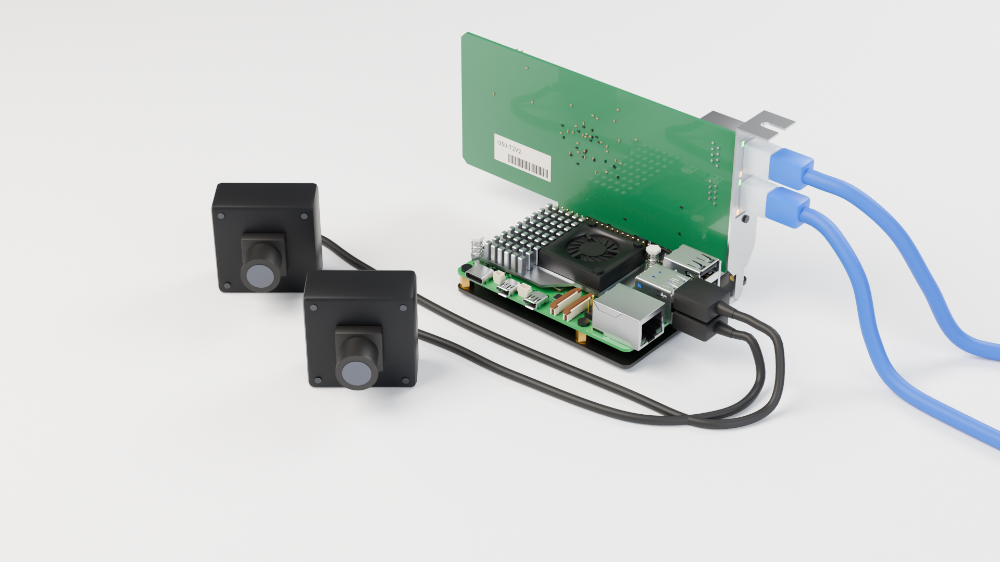

# Build a Pi controller

Keep the control loop beside the robot. Use your laptop for Python, policies, and teleoperation.
This guide builds a Pi 5 controller with an Intel dual-port Ethernet card, for one or two arms.

<figure class="hardware-figure">

<figcaption>Reference assembly: Pi 5 + Active Cooler + P02 PCIe adapter + Intel I350-T2 V2. Cameras are optional. This is a CAD illustration.</figcaption>
</figure>

## Follow these steps

<ol class="setup-path">
<li><a href="./pi-hardware.html"><strong>Parts and assembly</strong>Shopping links, the cooler and PCIe board, and which cable goes where.</a></li>
<li><a href="./pi-system.html"><strong>System and network</strong>Install the realtime kernel, enable the Intel NIC, and connect the arms.</a></li>
<li><a href="./pi-software.html"><strong>Node and laptop client</strong>Install franka-node, read the first state, then try a small motion.</a></li>
<li><a href="./pi-enclosure.html"><strong>Optional enclosure</strong>Explore the 3D assembly and download the printable case or editable CAD.</a></li>
</ol>

## What runs where?

| On your laptop | On the Pi | At the robot |
|---|---|---|
| Your application sends targets over Zenoh | `franka-node` runs `franka-rs` at 1 kHz | One wired Intel NIC port per arm |

The Pi's built-in Ethernet or Wi-Fi connects to your laptop's network. The Intel card's
ports connect directly to the robot control units. Cameras plug into the Pi's USB ports.

Have only one arm? Use one Intel port and omit the second arm's configuration.
You can also use a Pi's built-in Ethernet for a single arm and Wi-Fi for the laptop;
the Intel card and P02 are the illustrated dual-arm build, not a library requirement.

Already have a working realtime host? Go straight to [step 3](./pi-software.md).
For direct Rust or Python without a node, [choose your setup](./choose-your-setup.md).

<nav class="guide-nav" aria-label="Setup steps"><a rel="prev" href="./choose-your-setup.html">Choose another setup</a><a rel="next" href="./pi-hardware.html">Start: parts and assembly</a></nav>
