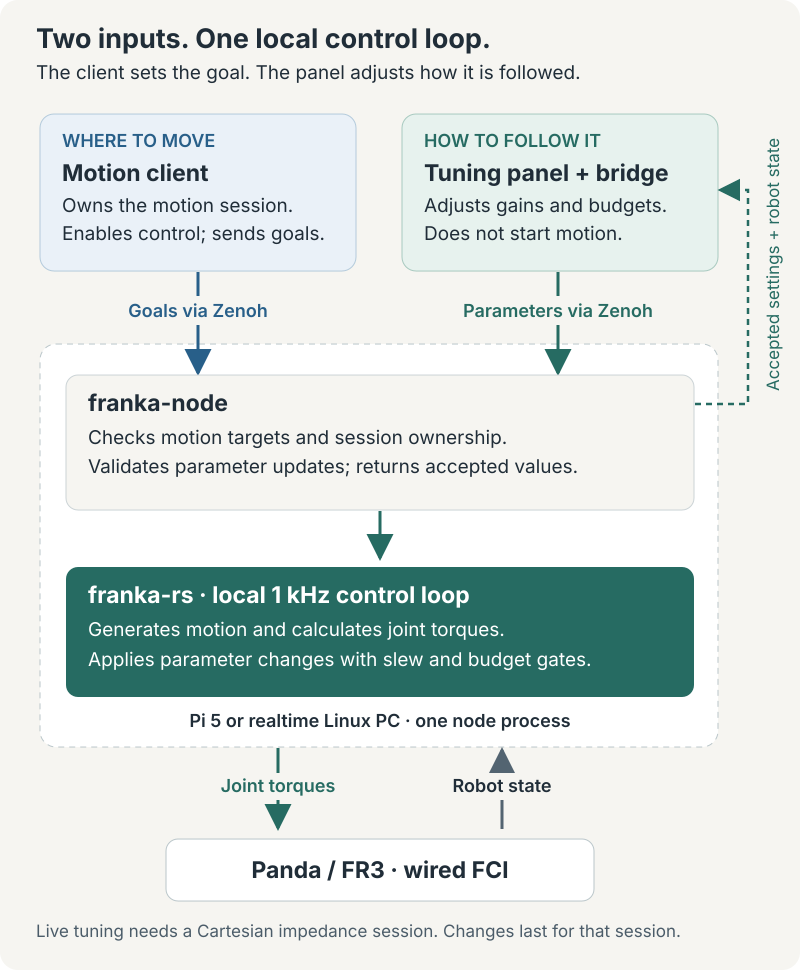

# Tune a running controller

Live tuning changes how an existing Cartesian control session tracks its targets, without
restarting the node. Use it to compare tracking, damping and motion limits. Ordinary motion
does not require the panel or any live parameter changes: start with the shipped configuration.

<figure class="flow-figure">
  <div class="flow-scroll" tabindex="0" role="region" aria-label="Live tuning diagram; scroll horizontally on small screens">
    
  </div>
  <figcaption>Motion goals and tuning are separate inputs. Both reach the same local controller. <a href="../assets/live-tuning-flow.svg">Open full-size diagram</a>.</figcaption>
</figure>

The motion client still owns the arm and keeps the session alive. The panel changes controller
parameters; it does not acquire the arm, start motion or replace the motion client. Live tuning
currently requires a running **Cartesian impedance session**. An idle arm or a joint-target
session returns `not_ready` when asked to change parameters.

## Open the optional panel

Start the node and your Cartesian client using [Serve arms over Zenoh](./franka-node.md).
The panel is the `franka-tuning-panel` command of the Python client; install the client as
described in [From Python](./franka-node.md#from-python), then:

```sh
franka-tuning-panel --connect tcp/127.0.0.1:7447 --no-multicast \
  --presets ./tuning-presets.json
```

This example runs the bridge on the same machine as a node listening on port 7447. Open
`http://127.0.0.1:8765/` and select the arm.

The panel is a pure consumer, so it opens a Zenoh **client** session (`--mode client`, the
default): it dials out and is never dialled, which is what works through a tunnel, and it still
scouts by multicast, so a node on the same LAN needs no `--connect`. A client will not start
with nothing to reach — start the node first, or pass `--mode peer` to hold a session open
while you wait. `--listen` needs `--mode peer`; `--zenoh-config` wins over all of these flags.

For a Pi-hosted bridge, tunnel it from the laptop:

```sh
ssh -N -L 8765:127.0.0.1:8765 <pi-user>@<pi-address>
```

Then open the same local URL on the laptop; the panel stays on loopback and only the tunnel
reaches it. That is the default, and the one to keep while a robot runs unattended; to serve
the panel to the network instead, see [below](#reach-it-from-another-machine). Access to the
node's Zenoh bus also permits parameter changes: tuning requests identify their sender but do
not require the motion lease holder.

`--presets` names the panel's preset file, by default
`~/.local/state/franka-tuning/presets.json`. Presets never change the node's TOML. Each saved
preset holds the owners' values, a note, and the metrics snapshot at the moment of saving,
stamped with the `effective_hz` it was measured at — snapshots taken at different effective
rates are not comparable.

To explore the interface without a robot, run these in two terminals from the repository
root instead; the mock is a test tool that stays in the repository. The mock is an owner, so it
listens as a peer; the panel dials it as a client:

```sh
python crates/franka-node/python/tests/panel_tests/mock_owner.py --listen tcp/127.0.0.1:17447 --no-multicast
```

```sh
franka-tuning-panel --connect tcp/127.0.0.1:17447 --no-multicast \
  --presets ./tuning-presets.json
```

The mock's teleoperation controls demonstrate an additional parameter owner; they do not
mean that a teleoperation service is included in `franka-node`.

## Reach it from another machine

A tunnel is not the only way. `--expose-to-network` serves the panel to the network it binds,
so a laptop or a tablet opens it like any other service on the bench:

```sh
franka-tuning-panel --host 0.0.0.0 --expose-to-network --connect tcp/127.0.0.1:7447
```

**There is no authentication.** An exposed panel lets anyone who can reach that port — every
machine, and every person, on that network — change any live parameter of a moving robot: its
springs, its damping, its motion budgets. Serve it on a network you control, while you are at
the bench, and stop it afterwards. The startup line names the URLs it has opened and who can
reach them:

```text
WARNING tuning-bridge: the panel is at http://192.0.2.5:8765/, reachable by anyone on that
network: it has no authentication, so any of them can set every live parameter of every arm on
the bus, while it moves
```

Exposed, the panel serves a request whose `Host` header is an **IP address**, alongside the
loopback names, so `http://192.0.2.5:8765/` works from another machine whatever the address
is. A `Host` that is a DNS name is still refused — including one that merely contains an
address, such as `192.0.2.5.evil.example` — and that refusal is what keeps the panel's one
browser-side defence: any page on the internet can point its own name at this port (DNS
rebinding), and the browser would then count it same-origin with the panel and let it drive the
arm; a rebound name is never an IP literal. Bound to loopback, the loopback names stay the only
ones served, whatever page asks.

To reach the panel by name, name it — exactly, and repeat the flag for more than one:

```sh
franka-tuning-panel --host 0.0.0.0 --expose-to-network --allowed-host bench-host.local
```

`--allowed-host` matches the whole name, never a suffix, so allowing `bench-host.local` does not
allow `bench-host.local.evil.example`. It requires `--expose-to-network`, and it is only as
trustworthy as whoever can answer for that name: `.local` names are answered by mDNS, which
anyone on the network can claim, and a page served from a name the panel accepts is same-origin
with the panel. Prefer the address.

What the `Origin` check does, and does not, protect: a **browser** that posts a change must send
an `Origin` equal to the address in its own URL bar, so a page served from anywhere else cannot
write even when it aims straight at the panel's address. A script sends no `Origin` at all, and
nothing here stops it — one `curl` from any machine on that network retunes a moving arm. The
panel is also plain HTTP, so an exposed session is readable and injectable by anyone on the
path. Exposure is a decision about who is on that network, not a permission the panel checks.

## What the controls change

There are nine named fields containing 25 scalar values. The panel gets ranges, units,
defaults and confirmation thresholds from the running node's schema, generated from the
same `LiveTuning::BOUNDS` table that checks updates. There is no separate panel limits table.

| Field | Meaning |
|---|---|
| `joint_stiffness[7]` | Joint springs in the impedance law. |
| `joint_damping[7]` | Joint damping; the node enforces a floor tied to each joint spring. |
| `cartesian_stiffness` | Scales the Cartesian stiffness preset and its associated damping. |
| `ik_damping` | Damping of the inverse-kinematics solve near poorly conditioned poses. |
| `ik_nullspace_gain` | Posture correction in the redundant degree of freedom; zero disables it. |
| `velocity_feedforward_gain` | Weight of the goal velocity in the damping term; zero disables feedforward. |
| `velocity_feedforward_cutoff` | Filter cutoff for that velocity; the schema marks the filter-off value. |
| `budget[3]` | Translation velocity, acceleration and jerk norm limits. |
| `rotation_budget[3]` | Rotation velocity, acceleration and jerk norm limits. |

Change a small group of related settings, apply, and compare the same motion before and
after. Read the accepted values: the node can clamp a request or raise damping when a spring
is increased. Invalid requests change nothing. Crossing a budget's confirmation threshold,
or raising `velocity_feedforward_gain` above zero, requires an explicit confirmation; already
being above it does not ask again. The wrist joints' damping (joints 5 to 7) is capped lower
than the others', at 40 instead of 60 Nm·s/rad, to keep the velocity barrier stable on their
lighter inertia.

Gains approach their targets with a 0.3 s time constant. Budget velocity and acceleration
limits rise immediately but ramp downward, to avoid abruptly truncating the generator's
velocity or acceleration. Budget jerk and the feedforward filter cutoff step immediately.
This handling removes the need to design those parameter transitions in the client; it does
not make every combination or every robot pose feasible.

A lowered budget never steps the command, but lowering its acceleration or jerk while the arm
moves lengthens the stop (toward v²/2a, plus the jerk's ramp), so a near goal is overshot and
returned to. For example, at the default 0.3 m/s (0.17 m/s per axis), an acceleration dragged
from 0.5 to 0.1 m/s² with the goal 3 cm ahead overshoots it by about 20 cm; faster motion or a
lower acceleration overshoots further. Lower the velocity first, apply it, then lower the
acceleration or jerk.

The displayed `params` are **accepted targets**, not a measurement of the gains applied on
each realtime cycle. `slewing` estimates the fraction of the latest change **still to go**:
near 1 just after acceptance, approaching 0. It is calculated from elapsed time, not fed back
from the controller; overlapping changes and missed cycles limit its accuracy.

## Why feedforward reads zero

Velocity feedforward is off by default (`velocity_feedforward = false`); with it on, real arms
vibrated. The boolean takes precedence at session start, so the live weight is **0** whatever
`velocity_feedforward_gain` says. Setting `velocity_feedforward_gain` above zero live, which
needs a confirmation, enables its contribution for that session; lowering
`velocity_feedforward_cutoff` filters the goal velocity it feeds forward, and is the knob to
try against vibration (no value has been validated on hardware). To enable it in future
sessions, set `velocity_feedforward = true` and
the desired gain in TOML, then restart the node to load the configuration.

## What is saved

Live changes last only for the current session. On session end, values revert to the loaded
TOML baseline, `origin` becomes `null`, and `dirty` becomes `false`. The next session starts
from that baseline. A node restart also restores the configuration and changes `boot_id`.

The version counts accepted updates during a node run: session end does **not** reset it;
node restart does. `dirty` compares accepted targets with the baseline, not the controller's
instantaneous gains. Panel presets are separate JSON files. They do not edit TOML, and there
is no `params/save` endpoint. Put a chosen setup into TOML explicitly after reviewing it.

## Read the diagnostics with their limits

Panel jitter, lag and tracking measurements are computed from published robot state at about
100 Hz, not from the 1 kHz loop, and they are not a complete trace of it. A node publishing
faster is sampled 1 in N by the panel, which says so at startup and in the live header
(`metrics from 1 in 10 of a 1000 Hz stream`); the metrics snapshot and every saved preset carry
`effective_hz`. The numbers therefore mean the same thing at any `state_hz`: lag and the windows
behind it are measured against the rate the panel really sees, so a `state_hz` that 1 in N cannot
bring to exactly 100 (250 Hz gives 125 Hz) still times correctly. What does ride with that rate is
the jitter filter's 3 Hz corner (3.75 Hz at 125 Hz) and how a vibration above half the effective
rate folds into the band, so compare jitter figures between snapshots at the same `effective_hz`.
`state_hz = 100` is the setting to run: above it the panel drops the extra messages before
decoding them, but they still cross the Zenoh callback, which on a Pi is real CPU. The node does
not yet publish leash-alteration counts or cap-active fractions. Joint inertia hints are
unavailable, and the headroom display also needs a compatible teleoperation owner's limits.
A missing metric is not evidence that a limit was never reached.

Larger Cartesian budgets can still reach joint-side limits depending on pose, payload and
trajectory; there is no universal translation speed that guarantees success. Robot reflexes,
collision settings, session deviation guards and the client's own target pacing remain in
effect. Those guards are not loosened by tuning a budget.

For client implementations and precise message semantics, see the
[node parameters protocol](../reference/node-parameters.md).
