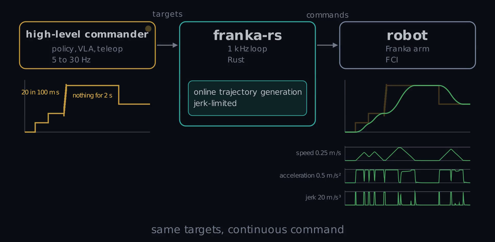

  

<h1 align="center" id="franka-rs">franka-rs</h1>

`franka-rs` is a Rust client for the Franka Control Interface, the network protocol a
Franka Research 3 or a Franka Emika Robot (Panda) is controlled through. It speaks that
protocol itself: a TCP channel for commands and the 1 kHz UDP loop for state and commands,
with the robot's kinematics and dynamics evaluated in the crate. There is no libfranka and
no C++ underneath, so `cargo add franka-rs` or `pip install franka-rs` is the whole
installation, and one program drives both robot generations because the protocol version
is negotiated when it connects.

The 1 kHz loop is the library's job. Your program can be a 1 kHz controller if you want,
or a policy at 10 Hz, a script, a notebook cell or a person at a keyboard: it sends
targets at its own rate and the crate turns them into a continuous command the robot
accepts.

Stepped, bursty, stalling targets in; one continuous command out. Illustration of the
generator's profile for a scripted target sequence under a 0.25 m/s, 0.5 m/s², 20 m/s³
budget.

## What you get

- **The realtime loop as a library.** Write the loop yourself as a callback or with
  `read_once` / `write_once`, or let the crate run it on a realtime thread and set targets
  from any thread at any rate. Stepped, bursty or stalled targets become a smooth command
  under a velocity, acceleration and jerk budget, tracked by the crate's own impedance
  torques (the arm stays compliant) or by the robot's controller; `stop()` settles and
  finishes the motion.
- **A small, safe footprint.** One crate. Parsing, rate limiting, trajectory generation and
  the control loops are safe Rust and allocate nothing once a motion has started; the
  `unsafe` in the crate is confined to the scheduler and socket system calls and to the
  opt-in loader for the model an FER serves. It cross-compiles to aarch64.
- **Checked against the reference.** Wire layouts, rate limiting, low-pass filtering and
  error text are checked against libfranka's sources. Loop timing, measured side by side on
  real FR3 and FER arms, is the same as libfranka's; the model agrees to 1e-14.

## Start here

| You want to… | Where to look |
|---|---|
| install it and move the arm for the first time | [Install](./getting-started/install.md), [The realtime machine](./getting-started/realtime-machine.md), [First program](./getting-started/first-program.md) |
| drive it from Python or a notebook | [From Python](./getting-started/python.md) |
| try it without a robot | [Without a robot: franka-sim](./getting-started/simulator.md) |
| know what can stop you before it does | [Things to keep in mind](./concepts/fci.md) |
| do one specific thing | the How-to pages, starting with [Command from a low-rate program](./howto/target-control.md) |
| see the protocol, the constants and the measurements | the Reference pages, starting with [Compared with libfranka](./reference/libfranka.md) |
| read the rustdoc | [API reference](./api-reference.md) |

## Status

Version 0.3. Both protocol versions, every control interface, target control from Rust
and Python, the gripper and the flight recorder have run on real arms; the dates and
figures are in [Benchmarks and hardware validation](./reference/benchmarks.md). The
impedance backend of target control, new in 0.3.0 and the default, has run on franka-sim
and on two real FERs, not yet on an FR3. Not there yet: a `ros2_control` hardware
interface, the vacuum gripper, and a published simulator image for the FER. The
[changelog](./changelog.md) lists what changed in each release.

`franka-rs` is an unofficial project and is not affiliated with Franka Robotics GmbH;
Franka, Franka Emika, Panda and FR3 are their trademarks. The crate is Apache-2.0, like
libfranka. Its API shape was informed by Marco Boneberger's
[libfranka-rs](https://github.com/marcbone/libfranka-rs); no code from it is used.
