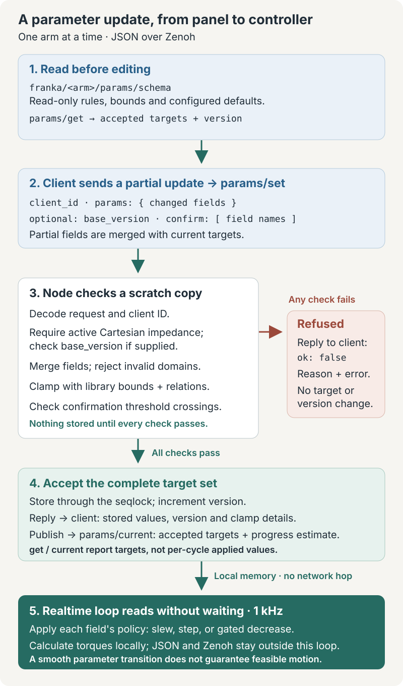
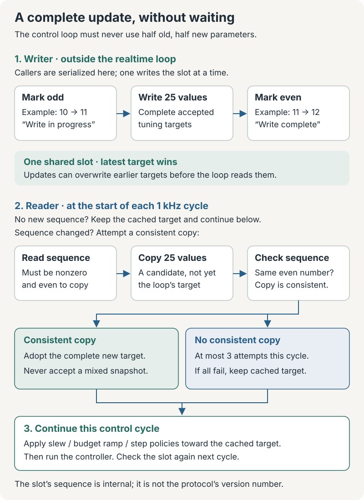

# Node parameters protocol

`franka-node` exposes live Cartesian impedance tuning through JSON over Zenoh. This page
defines the node's `params/*` surface; [Tune a running controller](../howto/live-tuning.md) describes
its use. Motion targets, state and command messages remain separate.

## From request to controller

<figure class="flow-figure">
  <div class="flow-scroll" tabindex="0" role="region" aria-label="Parameter update diagram; scroll horizontally on small screens">
    
  </div>
  <figcaption>Acceptance confirms a new target set. It does not mean the controller has already finished transitioning to it. <a href="../assets/parameter-update.svg">Open full-size diagram</a>.</figcaption>
</figure>

## Keys and discovery

| Key | Kind | Payload |
|---|---|---|
| `franka/<arm>/params/schema` | Queryable | No request payload; schema reply. |
| `franka/<arm>/params/get` | Queryable | No request payload; current accepted targets. |
| `franka/<arm>/params/set` | Queryable | Partial update and acceptance/refusal reply. |
| `franka/<arm>/params/current` | Publisher | Same body as `get`; on accepted updates, session reseeding and approximately every second. |

`<arm>` is the configured arm name. Wildcard queries such as `franka/*/params/schema` discover
arms; replies use each concrete arm key. Schema and get work without a running session.
Set requires a live Cartesian impedance session; idle and joint sessions return `not_ready`.

Tuning uses a positive `client_id` for attribution, **not authorization**: it does not check
that the sender owns the motion lease. Bus access must therefore be limited to trusted
operators. One set is atomic for one arm; no transaction spans arms or other parameter owners.

## Schema

The envelope contains `owner: "node"`, `arm`, `boot_id`, `schema_version: 1`, `params`,
`relations` and `derived`. Reject unsupported schema versions in a client.

Each `params` entry describes one field:

| Property | Meaning |
|---|---|
| `type` | Currently `f64`, `f64[3]` or `f64[7]`. |
| `min`, `max`, `default` | Scalar or matching-length arrays; defaults are this arm's configured session baseline. |
| `unit` | Optional scalar string or array of unit strings. |
| `policy` | `slew`, `step` or `step_up_gate_down`; a budget field reports the strongest policy among its elements. |
| `slew_tau_s` | Present for slewed fields. |
| `group`, `scale` | UI grouping and `linear` or `log` display. |
| `danger` | Absent, `"advise"` or `"confirm_above"`. `"advise"` marks a field that reaches the torque directly and asks for no confirmation. |
| `confirm_above` | Present exactly with `danger: "confirm_above"`: the threshold, in the field's scalar/array shape. |
| `slider_max`, `off_at`, `norm` | Optional presentation hints; the text entry can still use the full range. `norm: true` marks a velocity/acceleration/jerk budget, whose per-axis share is the norm divided by √3. |

Ranges and policies come directly from `LiveTuning::BOUNDS`, the library's own gate
([Tune the law while it runs](../howto/target-control.md#tune-the-law-while-it-runs));
clients must query them rather than maintain a copy. The nine fields are
`joint_stiffness`, `joint_damping`,
`cartesian_stiffness`, `ik_damping`, `ik_nullspace_gain`, `velocity_feedforward_gain`,
`velocity_feedforward_cutoff`, `budget` and `rotation_budget` (25 scalar values total).

`relations` contains human-readable `{"rule": "..."}` entries. Currently the joint damping
floor depends on the corresponding joint stiffness. The node enforces that relation; clients
should show the rule and the accepted values rather than independently interpreting its text.

`derived` is read-only: `leash{translation,rotation}`, `max_lead`, `max_lead_rotation`,
`max_step`, `max_step_rotation`, `max_step_joint`, `rate_hz`, `state_hz`, `stop_after_ms`,
`delta_t`, `dq_limit[7]`, `cutoff_frequency`, and
`cartesian_preset{stiffness[6],damping[6],reference}`. Joint velocity limits depend on the
connected robot's FCI version. There is no `joint_inertia` value or node metrics endpoint.

## Get and current

The body contains:

| Property | Meaning |
|---|---|
| `owner`, `arm`, `boot_id` | Owner, arm and node-run identity. |
| `version` | Number of accepted sets in this node run. |
| `t_node_ns` | Node-host monotonic timestamp in nanoseconds. |
| `origin` | `null` after initialization or session reseeding; otherwise `{version, by, at_ns}` for the last accepted set. `by` echoes its numeric `client_id`. |
| `params` | Complete accepted tuning targets, or the TOML-derived baseline without a tunable session. |
| `slewing` | Field name to estimated fraction of the latest accepted change still remaining. |
| `dirty` | Whether accepted targets differ from the loaded configuration's baseline. |

`params` does **not** expose the controller's per-cycle interpolated values. For slewed fields,
remaining fraction decays with the published time constant. For downward budget ramps it is
estimated from the previous and new targets and elapsed time. Array fields report the largest
remaining fraction; fractions below 0.005 are omitted. Stepped, unchanged or settled fields
are omitted. This is a wall-clock estimate of the latest update, not realtime feedback, and
does not track all overlapping transitions.

Session start/end restores configuration values and clears `origin` and `slewing`, while
keeping `version`. Node restart creates a new `boot_id` and resets `version` to zero. A
client should refresh after either a boot change or a reseed; `base_version` alone cannot
detect session reseeding or a restart that happens to reach the same version again.

The live feedforward gain is seeded as zero when TOML has `velocity_feedforward = false`, the
default, regardless of `velocity_feedforward_gain`. There is no separate live boolean field;
its `confirm_above` is 0, so switching it on live needs a confirmation.

## Set request and validation

For example, after fetching the current version:

```json
{
  "client_id": 7,
  "base_version": 2,
  "params": {"ik_damping": 0.1}
}
```

`client_id` is a nonzero `u32`. `base_version` is optional optimistic concurrency control:
if present, it must match the current version. Optional `confirm` is an array of field names.
Omitted parameter fields retain their values; an included array must contain every element.
Unknown top-level request properties are rejected; unknown names in `confirm` are ignored.

The node processes a request in this order:

1. Deserialize the envelope and validate `client_id`.
2. Require a tunable session and check `base_version`.
3. Validate field names, number types, lengths and finite values; merge into a scratch copy.
4. Reject invalid domains before clamping: notably nonpositive `ik_damping` or
   `cartesian_stiffness`. A request for zero is refused, not converted to the minimum.
5. Clamp requested fields using the library bounds, including the stiffness-dependent damping
   floor. Increasing a spring may also raise damping that the request omitted.
6. Check confirmation crossings against these proposed stored values.
7. Store the complete accepted target set, increment version, reply and publish current.

Any refusal leaves the targets and version unchanged. An accepted empty/no-op update still
increments the version. Configuration seeds and unchanged fields are not automatically
re-clamped by a partial update; schema bounds describe the live update gate.

`confirm_above` means **crossing from at or below the threshold to above it**, using current
stored targets and the clamped proposed targets. For arrays, any element crossing requires
the field name in `confirm`. Already-high values can be increased further or lowered without
another confirmation. `danger: "advise"` does not require confirmation.

## Replies

Accepted replies contain `ok: true`, the new `version`, the complete stored `params`,
`clamped` and `slewing`. Each clamp is:

```json
{"field": "joint_damping", "index": 0, "requested": 0.0, "stored": 1.0}
```

This is the record's shape, not a recommended gain. `index` is zero-based for array fields
and `null` for scalars. If the damping relation changed an omitted field, `requested` is
that field's previous value. Always use the reply's stored values.

Refused replies contain `ok: false`, `reason`, `field` (or `null`), human-readable `error`
and the unchanged `version`. The protocol vocabulary is `type`, `non_finite`, `length`,
`unknown_field`, `relation`, `needs_confirm`, `stale`, `not_ready`, `busy`, `invalid`.
The current node maps library gate errors to `invalid` with `field: null` and the field
named in `error`; `relation` and `busy` are reserved vocabulary rather than promised outcomes.
Malformed JSON, including JSON representations that cannot encode a finite number, can be
rejected as `type` before field decoding.

The optional HTTP bridge adds its own failures, such as `unreachable`, `aborted`,
`bad_schema`, `no_state` and `stale_state`. These are not node parameter refusals.

## How the seqlock reaches the control loop

A **seqlock** is a shared slot with a sequence counter. It lets the realtime loop read a
complete set of 25 tuning values while another thread writes, without taking the writer's
mutex. That matters because the controller must not combine new stiffness with an old
damping value from a half-finished update.

<figure class="flow-figure">
  <div class="flow-scroll" tabindex="0" role="region" aria-label="Seqlock diagram; scroll horizontally on small screens">
    
  </div>
  <figcaption>The realtime loop accepts a complete snapshot or keeps its previous target. <a href="../assets/tuning-seqlock.svg">Open full-size diagram</a>.</figcaption>
</figure>

The library serializes writers outside the realtime loop. A writer increments the sequence
to an odd number, stores all 25 values, then increments it to an even number. The reader
accepts its copy only when the sequence is nonzero, even and unchanged across the copy.

Each control cycle first checks whether the sequence changed. If it did, the reader makes
**at most three attempts** to obtain a consistent snapshot. If all fail, it keeps the previous
complete target, continues any transition toward that target, and tries again next cycle.
It does not wait for the writer. An unchanged slot costs just the initial sequence check.

This is a **latest-value slot, not a queue**: several accepted updates between control cycles
can collapse into one observed target. Acceptance therefore does not mean each intermediate
target was applied to the robot. The slot's internal sequence counter is separate from the
JSON protocol's `version`, which counts accepted requests.

## Application and persistence

The arm thread validates and publishes tuning through a seqlock slot. The realtime loop
reads it without waiting and applies transitions locally; no JSON, Zenoh or panel work runs
on that loop. Gains slew with the schema's time constant. Budget velocity lowers no faster
than the acceleration limit, and acceleration lowers no faster than jerk; increases take
effect immediately. Jerk and feedforward cutoff step. This bounds parameter transitions,
not the feasibility of every requested robot motion.

There is no `params/save`. Changes last only until the session ends. Edit TOML and restart
the node for a persistent baseline; panel preset storage is separate.

`t_node_ns` and `origin.at_ns` use the node host's `CLOCK_MONOTONIC`, as does robot state
telemetry. They are not Unix time and are not directly comparable across hosts. State remains
the packed binary `StateMsg` at configured `state_hz`; node status is node-scoped JSON at
`franka/node/<name>/status`. Neither is a per-cycle report of applied tuning. See
[Serve arms over Zenoh](../howto/franka-node.md) for those channels.
